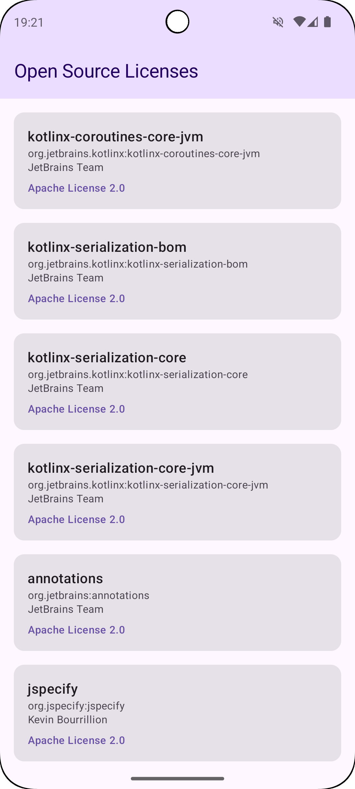

# License Scribe Plugin

[](https://github.com/syarihu/license-scribe-plugin/actions/workflows/build-and-test.yml)
[](https://central.sonatype.com/namespace/net.syarihu.licensescribe)

A Gradle plugin that acts as your project's scribe, carefully recording and cataloging license information for Android/Kotlin dependencies into clean, accessible code.

## Which Plugin Should I Use?

| Plugin | Use Case |
|--------|----------|
| `license-scribe-gradle-plugin` | Want to manage license definitions in Git, customize the license screen UI, or need fine-grained control over license information |
| `license-scribe-screen-plugin` | Want to quickly add an OSS license screen with minimal setup - no YAML management or custom UI needed *(available from 0.2.0)* |
| `license-scribe-hilt-plugin` | Using `license-scribe-gradle-plugin` and want Hilt DI integration |

## Features

### license-scribe-gradle-plugin

- Automatically detects project dependencies and their licenses (including transitive dependencies)
- **Parent POM resolution** - detects licenses from parent POMs when not specified in the artifact's own POM
- **License-first YAML structure** - instantly see all licenses used in your project at a glance
- **Variant-aware** - generates separate license files per build variant, including product flavor support (e.g., `debug`, `stagingDebug`, `productionRelease`)
- **Smart license detection** - URL-based license identification for more accurate classification
- **Vendor separation** - proprietary and ambiguous licenses are kept separate per vendor
- Generates Kotlin code for easy access to license information in your app
- Works with Android (application/library) and pure Kotlin/JVM projects
- **Multi-module support** with `LicenseProvider` interface for dependency injection
- **Optional Hilt integration** for seamless DI in feature modules
- **Minimal runtime footprint** - only `LicenseInfo` and `LicenseProvider` classes are included in your APK

### license-scribe-screen-plugin

- **Zero configuration** - automatically generates a complete license screen Activity
- **No YAML management** - license information is extracted directly from dependencies
- **Customizable appearance** - theme color, toolbar title, and title text can be customized at runtime
- **Dark mode support** - follows system theme by default, or can be forced to light/dark mode
- **Edge-to-edge support** - modern Android UI with proper WindowInsets handling
- **Material Design** - card-based UI with ripple effects

## Project Structure

```
license-scribe-plugin/
├── license-scribe-runtime/       # Minimal runtime library (LicenseInfo, LicenseProvider only)
├── license-scribe-core/          # Core library (parser, generator - build-time only)
├── license-scribe-gradle-plugin/ # Main Gradle plugin (YAML-based license management, custom UI)
├── license-scribe-hilt-plugin/   # Optional plugin for gradle-plugin (Hilt DI support)
├── license-scribe-screen-plugin/ # Standalone plugin (auto-generated license screen)
├── example/                      # Example Android app
├── example-library/              # Example library module (for transitive dependency testing)
├── example-screen/               # Example app for screen plugin
├── Makefile                      # Development commands
└── build.gradle.kts              # Root build configuration
```

## Requirements

- JDK 17+
- Gradle 8.0+
- Android Gradle Plugin 8.0+ (for Android projects)

## Installation

This plugin is available on **Maven Central**.

### settings.gradle.kts

```kotlin
pluginManagement {
    repositories {
        gradlePluginPortal()
        mavenCentral()
        google()
    }
}
```

### build.gradle.kts (app module)

```kotlin
plugins {
    id("net.syarihu.license-scribe") version "<latest-version>"
}

dependencies {
    // Required: Runtime library provides LicenseInfo and LicenseProvider
    implementation("net.syarihu.licensescribe:license-scribe-runtime:<latest-version>")
}
```

### For Local Development

> **Note:** Use `mavenLocal()` for local builds when developing or testing unreleased versions.

#### settings.gradle.kts

```kotlin
pluginManagement {
    repositories {
        mavenLocal()  // For local development
        gradlePluginPortal()
        mavenCentral()
        google()
    }
}
```

#### build.gradle.kts (app module)

```kotlin
plugins {
    id("net.syarihu.license-scribe") version "<latest-version>-SNAPSHOT"
}

dependencies {
    // Required: Runtime library provides LicenseInfo and LicenseProvider
    implementation("net.syarihu.licensescribe:license-scribe-runtime:<latest-version>-SNAPSHOT")
}
```

### Configuration

```kotlin
licenseScribe {
    // Base directory for license files (default: project directory)
    // Recommended: use a dedicated directory to keep things organized
    baseDir.set(layout.projectDirectory.dir("licenses"))

    // Package name for generated code (required)
    generatedPackageName.set("com.example.app")

    // Class name for generated code (default: "Licenses")
    generatedClassName.set("AppLicenses")

    // File names (optional, with defaults)
    // licensesFile.set("scribe-licenses.yml")
    // ignoreFile.set(".scribeignore")
}
```

## Usage

### 1. Initialize License Files

Run the init task to create the initial license management files:

```bash
# For Android projects (with variants)
./gradlew scribeLicensesDebugInit

# For non-Android projects
./gradlew scribeLicensesInit
```

This creates (in variant subdirectory for Android projects):
- `licenses/{variant}/scribe-licenses.yml` - Defines licenses and their artifacts (license-first structure)
- `licenses/{variant}/.scribeignore` - Patterns for artifacts to ignore

For example, running `scribeLicensesDebugInit` with `baseDir.set(layout.projectDirectory.dir("licenses"))` creates:
```
licenses/
├── debug/
│   ├── scribe-licenses.yml
│   └── .scribeignore
└── release/
    ├── scribe-licenses.yml
    └── .scribeignore
```

**With Product Flavors:**

If your project uses product flavors, variant names include the flavor (e.g., `stagingDebug`, `productionRelease`):
```
licenses/
├── stagingDebug/
│   ├── scribe-licenses.yml
│   └── .scribeignore
├── stagingRelease/
│   └── ...
├── productionDebug/
│   └── ...
└── productionRelease/
    └── ...
```

This allows tracking different dependencies per build variant (e.g., `debugImplementation` vs `releaseImplementation`, or flavor-specific dependencies).

### Ignore File (`.scribeignore`)

The `.scribeignore` file allows you to exclude specific artifacts from license tracking. This is useful for:
- Internal company libraries that don't need license attribution
- Test-only dependencies
- Dependencies with bundled licenses that don't require separate attribution

**Supported patterns:**

```
# Single artifact (exact match)
com.example:library-name

# All artifacts from a group (wildcard)
com.example:*

# Comments start with #
# Lines starting with # are ignored
```

**Example `.scribeignore`:**

```
# Internal libraries
com.mycompany:internal-utils
com.mycompany:*

# Test utilities
junit:junit
org.mockito:*
```

### 2. Review and Edit Definitions

Edit `scribe-licenses.yml` to add missing information. The file uses a **license-first structure** where artifacts are grouped under their license.

**Benefits of license-first structure:**
- Instantly see all license types used in your project by looking at the top-level keys
- Easily identify which libraries use specific licenses (e.g., GPL, LGPL)
- Simplifies license compliance review and auditing
- Makes it easy to spot libraries that need attention (grouped under `unknown`)

```yaml
licenses:
  apache-2.0:
    name: The Apache License, Version 2.0
    url: http://www.apache.org/licenses/LICENSE-2.0.txt
    artifacts:
      com.example:
      - name: library-name
        url: https://github.com/example/library
        copyrightHolders:
        - Example Inc.
      com.squareup.okhttp3:
      - name: okhttp
        url: https://square.github.io/okhttp/
        copyrightHolders:
        - Square, Inc.

  mit:
    name: MIT License
    url: https://opensource.org/licenses/MIT
    artifacts:
      org.example:
      - name: some-lib
        copyrightHolders:
        - Some Developer
```

#### Dual Licensing Support

For libraries with dual licensing, you can specify alternative or additional licenses:

```yaml
licenses:
  apache-2.0:
    name: Apache License 2.0
    url: https://www.apache.org/licenses/LICENSE-2.0
    artifacts:
      com.example:
      - name: dual-licensed-lib
        copyrightHolders:
        - Example Inc.
        alternativeLicenses: [mit]  # OR: user can choose either license

  gpl-2.0:
    name: GNU General Public License v2.0
    url: https://www.gnu.org/licenses/gpl-2.0.html
    artifacts:
      com.example:
      - name: classpath-exception-lib
        copyrightHolders:
        - Example Inc.
        additionalLicenses: [classpath-exception]  # AND: both licenses apply
```

#### License Detection and Normalization

The plugin automatically normalizes license names to standard keys (e.g., `apache-2.0`, `mit`, `bsd-3-clause`). Detection is performed in this order:

1. **URL-based detection** (most reliable) - checks license URL for known patterns
2. **Name-based detection** - matches common license name patterns

**Vendor-specific keys for proprietary/ambiguous licenses:**

Some POM files declare non-standard or ambiguous license names. The plugin handles these by creating vendor-specific keys:

| POM License Name | Generated Key | Example |
|------------------|---------------|---------|
| `Proprietary` | `proprietary-{vendor}` | `proprietary-adjust`, `proprietary-appsflyer` |
| `LICENSE` | `license-{vendor}` | `license-braze-inc` |

This prevents unrelated artifacts from being incorrectly grouped together.

**Supported license keys:**

The following license keys are automatically recognized and normalized:

| Key | License Name |
|-----|--------------|
| `apache-2.0` | Apache License 2.0 |
| `mit` | MIT License |
| `bsd-3-clause` | BSD 3-Clause License |
| `bsd-2-clause` | BSD 2-Clause License |
| `lgpl-2.1` | GNU Lesser General Public License v2.1 |
| `lgpl-3.0` | GNU Lesser General Public License v3.0 |
| `gpl-2.0` | GNU General Public License v2.0 |
| `gpl-3.0` | GNU General Public License v3.0 |
| `epl-1.0` | Eclipse Public License 1.0 |
| `mpl-2.0` | Mozilla Public License 2.0 |
| `cc0-1.0` | CC0 1.0 Universal |
| `unlicense` | The Unlicense |
| `isc` | ISC License |

**Ambiguous license warnings:**

When artifacts have ambiguous license names that don't identify a specific license type, the plugin shows a warning:

```
WARNING: Found 3 artifact(s) with ambiguous license names.
Please verify these licenses manually and update scribe-licenses.yml if needed:
  - com.braze:android-sdk-base: "LICENSE" (https://github.com/braze-inc/...)
  - com.adjust.signature:adjust-android-signature: "Proprietary" (https://github.com/adjust/...)
```

### 3. Check Licenses (Optional)

Check for missing attributes and validate that all dependencies are covered:

```bash
./gradlew scribeLicensesDebugCheck
```

### 4. Sync Licenses (Optional)

When dependencies change, sync definitions with current dependencies:

```bash
./gradlew scribeLicensesDebugSync
```

### 5. Generate Code

Generate Kotlin code (automatically runs during build):

```bash
./gradlew scribeLicensesDebugGenerate
```

### 6. Use Generated Code

Access license information in your app:

```kotlin
import com.example.app.AppLicenses
import net.syarihu.licensescribe.LicenseInfo

// Get all licenses
val licenses: List<LicenseInfo> = AppLicenses.all

// Display in UI
licenses.forEach { license ->
    println("${license.artifactName} - ${license.licenseName}")
    println("  ID: ${license.artifactId}")
    println("  URL: ${license.artifactUrl}")
    println("  Copyright: ${license.copyrightHolders.joinToString(", ")}")
    println("  License URL: ${license.licenseUrl}")
}
```

## Multi-Module Support

In multi-module projects, you may want to display licenses in a feature module (e.g., `:feature:settings`) while the plugin is applied to `:app`. The `LicenseProvider` interface enables this pattern.

### Using LicenseProvider Interface

The generated code implements `LicenseProvider` from `license-scribe-runtime`:

```kotlin
// Generated in :app module
object AppLicenses : LicenseProvider {
    override val all: List<LicenseInfo> = listOf(...)
}
```

### Feature Module Setup

In your feature module, depend only on `license-scribe-runtime`:

```kotlin
// feature/settings/build.gradle.kts
dependencies {
    implementation("net.syarihu.licensescribe:license-scribe-runtime:<latest-version>")
}
```

Then use `LicenseProvider` via dependency injection:

```kotlin
// In feature module
class LicenseScreen(
    private val licenseProvider: LicenseProvider
) {
    fun showLicenses() {
        licenseProvider.all.forEach { license ->
            println(license.artifactName)
        }
    }
}
```

## Hilt Integration (Optional for license-scribe-gradle-plugin)

For projects using `license-scribe-gradle-plugin` with Hilt, the optional `license-scribe-hilt` plugin generates a Hilt module automatically.

### Setup

```kotlin
// app/build.gradle.kts
plugins {
    id("net.syarihu.license-scribe") version "<latest-version>"
    id("net.syarihu.license-scribe-hilt") version "<latest-version>"
}
```

### Generated Hilt Module

The plugin generates:

```kotlin
@Module
@InstallIn(SingletonComponent::class)
object LicenseScribeHiltModule {
    @Provides
    @Singleton
    fun provideLicenseProvider(): LicenseProvider = AppLicenses
}
```

### Usage in Feature Module

```kotlin
// feature/settings/build.gradle.kts
dependencies {
    implementation("net.syarihu.licensescribe:license-scribe-runtime:<latest-version>")
}

// ViewModel in feature module
@HiltViewModel
class LicenseViewModel @Inject constructor(
    private val licenseProvider: LicenseProvider
) : ViewModel() {
    val licenses: List<LicenseInfo> = licenseProvider.all
}
```

## Screen Plugin

For developers who want to quickly set up an OSS license display screen without manual implementation, the `license-scribe-screen` plugin automatically generates a ready-to-use license list Activity. Unlike `license-scribe-gradle-plugin`, this plugin does not require YAML file management - license information is extracted directly from your project dependencies.

### Setup

```kotlin
// app/build.gradle.kts
plugins {
    id("net.syarihu.license-scribe-screen") version "<latest-version>"
}

dependencies {
    // Required: Runtime library
    implementation("net.syarihu.licensescribe:license-scribe-runtime:<latest-version>")

    // Required: AndroidX dependencies for generated Activity
    implementation("androidx.core:core-ktx:<latest-version>")
    implementation("androidx.activity:activity:<latest-version>")
    implementation("androidx.appcompat:appcompat:<latest-version>")
    implementation("androidx.recyclerview:recyclerview:<latest-version>")
}

licenseScribeScreen {
    // Package name for generated code (required)
    generatedPackageName.set("com.example.app")

    // Class name for licenses object (default: "AppLicenses")
    // licensesClassName.set("AppLicenses")

    // Class name for generated Activity (default: "OpenSourceLicensesActivity")
    // activityClassName.set("OpenSourceLicensesActivity")

    // Night mode setting (default: "followSystem")
    // - "followSystem": Follow system dark mode setting
    // - "yes": Always use dark mode
    // - "no": Always use light mode
    // nightMode.set("followSystem")
}
```

### Generated Files

The plugin generates the following files per build variant:

1. **`AppLicenses.kt`** - A Kotlin object containing all license information
2. **`OpenSourceLicensesActivity.kt`** - A ready-to-use Activity displaying the license list

### Usage

Launch the license screen from anywhere in your app:

```kotlin
import com.example.app.OpenSourceLicensesActivity

// Basic usage - launch with default styling
OpenSourceLicensesActivity.start(context)

// Customized usage - specify theme color and title
OpenSourceLicensesActivity.start(
    context = this,
    themeColor = Color.parseColor("#6200EE"),  // Toolbar background & accent color
    toolbarTitleColor = Color.WHITE,            // Toolbar title text color
    title = "Open Source Licenses"              // Custom title
)
```

### Customization Options

| Parameter | Type | Description |
|-----------|------|-------------|
| `context` | `Context` | Required. The context to start the activity from |
| `themeColor` | `Int?` | Optional. Theme color for toolbar background and license text accent |
| `toolbarTitleColor` | `Int?` | Optional. Toolbar title text color (auto-determined if not specified) |
| `title` | `String` | Optional. Custom title (default: "Open Source Licenses") |

### Example

See the `example-screen/` directory for a complete example:

```kotlin
class MainActivity : ComponentActivity() {
    override fun onCreate(savedInstanceState: Bundle?) {
        super.onCreate(savedInstanceState)
        setContent {
            Button(onClick = {
                // Default style
                OpenSourceLicensesActivity.start(this)
            }) {
                Text("Show Licenses")
            }

            Button(onClick = {
                // Purple theme
                OpenSourceLicensesActivity.start(
                    context = this,
                    themeColor = "#6200EE".toColorInt(),
                    toolbarTitleColor = Color.WHITE,
                )
            }) {
                Text("Show Licenses (Purple)")
            }
        }
    }
}
```

## Available Tasks

For Android projects, tasks are created per variant. The variant name depends on your project configuration:
- Without product flavors: `Debug`, `Release`, etc.
- With product flavors: `StagingDebug`, `ProductionRelease`, etc.

| Task | Description |
|------|-------------|
| `scribeLicenses{Variant}Init` | Initialize license management files |
| `scribeLicenses{Variant}Check` | Check definitions for missing attributes and validate against dependencies |
| `scribeLicenses{Variant}Sync` | Sync definitions with current dependencies |
| `scribeLicenses{Variant}Generate` | Generate Kotlin code for licenses |

Examples:
```bash
# Without product flavors
./gradlew scribeLicensesDebugInit
./gradlew scribeLicensesReleaseGenerate

# With product flavors
./gradlew scribeLicensesStagingDebugInit
./gradlew scribeLicensesProductionReleaseGenerate
```

## Development

### Prerequisites

- See [Requirements](#requirements) above
- Android SDK (required for running the example project)

### Build Commands

```bash
# Publish to Maven Local (required before building example)
make publish

# Build all modules
make build

# Publish and build
make all

# Run all integration tests
make test

# Clean build artifacts
make clean

# Apply code formatting
make format

# Check formatting
make check
```

### Manual Gradle Commands

```bash
# Publish all modules to Maven Local
./gradlew :license-scribe-runtime:publishToMavenLocal
./gradlew :license-scribe-core:publishToMavenLocal
./gradlew :license-scribe-gradle-plugin:publishToMavenLocal
./gradlew :license-scribe-hilt-plugin:publishToMavenLocal
./gradlew :license-scribe-screen-plugin:publishToMavenLocal

# Or publish all at once
./gradlew publishToMavenLocal

# Build example
./gradlew :example:assembleDebug

# Build screen example
./gradlew :example-screen:assembleDebug
```

### Configuration Cache

This plugin fully supports Gradle's Configuration Cache. If you encounter configuration cache errors, they may be caused by other plugins in your project.

## Example Projects

### example/

The `example/` directory contains a sample Android app demonstrating the main plugin usage:

- Shows how to configure the plugin
- Displays a license list using Jetpack Compose
- Demonstrates the generated `AppLicenses` and `LicenseInfo` classes



To run the example:

```bash
# First, publish the plugin to Maven Local
make publish

# Then build the example
./gradlew :example:assembleDebug
```

### example-screen/

The `example-screen/` directory demonstrates the screen plugin:

- Shows how to configure the screen plugin
- Demonstrates launching `OpenSourceLicensesActivity` with different theme colors
- No custom UI implementation required - just call `OpenSourceLicensesActivity.start(context)`

To run the screen example:

```bash
# First, publish the plugin to Maven Local
make publish

# Then build the example
./gradlew :example-screen:assembleDebug
```

## Generated Code Structure

### Runtime Library Classes

The `license-scribe-runtime` library provides:

#### LicenseInfo

```kotlin
package net.syarihu.licensescribe

data class LicenseInfo(
    val artifactId: String,                              // e.g., "com.example:library:1.0.0"
    val artifactName: String,                            // e.g., "library"
    val artifactUrl: String?,                            // Project URL
    val copyrightHolders: List<String>,                  // e.g., ["Example Inc."]
    val licenseName: String,                             // e.g., "The Apache License, Version 2.0"
    val licenseUrl: String?,                             // License URL
    val alternativeLicenses: List<AlternativeLicenseInfo>?,  // OR relationship (dual-licensing)
    val additionalLicenses: List<AdditionalLicenseInfo>?,    // AND relationship
)

data class AlternativeLicenseInfo(
    val licenseName: String,
    val licenseUrl: String?,
)

data class AdditionalLicenseInfo(
    val licenseName: String,
    val licenseUrl: String?,
)
```

#### LicenseProvider

```kotlin
package net.syarihu.licensescribe

interface LicenseProvider {
    val all: List<LicenseInfo>
}
```

### Generated Class

The plugin generates one class that implements `LicenseProvider`:

```kotlin
package com.example.app

import net.syarihu.licensescribe.LicenseInfo
import net.syarihu.licensescribe.LicenseProvider

object AppLicenses : LicenseProvider {
    override val all: List<LicenseInfo> = listOf(
        // All license entries
    )

    // Helper functions
    fun findByArtifactId(id: String): LicenseInfo?
    fun findByLicenseName(name: String): List<LicenseInfo>
}
```

## Acknowledgements

This project was inspired by [license-list-plugin](https://github.com/jmatsu/license-list-plugin).

## License

```
Copyright 2025 syarihu

Licensed under the Apache License, Version 2.0 (the "License");
you may not use this file except in compliance with the License.
You may obtain a copy of the License at

    http://www.apache.org/licenses/LICENSE-2.0

Unless required by applicable law or agreed to in writing, software
distributed under the License is distributed on an "AS IS" BASIS,
WITHOUT WARRANTIES OR CONDITIONS OF ANY KIND, either express or implied.
See the License for the specific language governing permissions and
limitations under the License.
```
